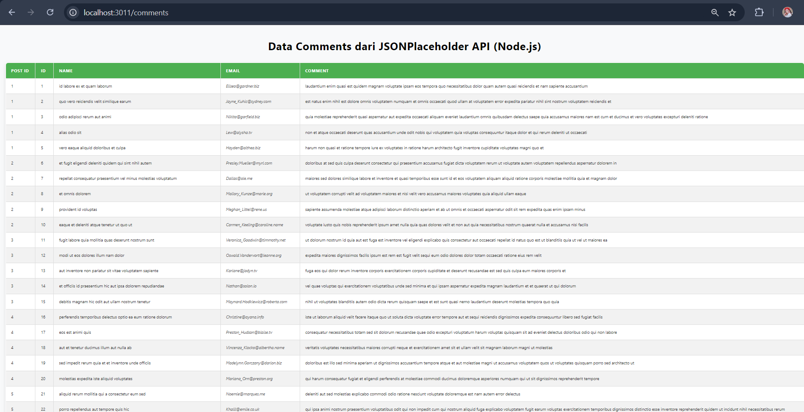
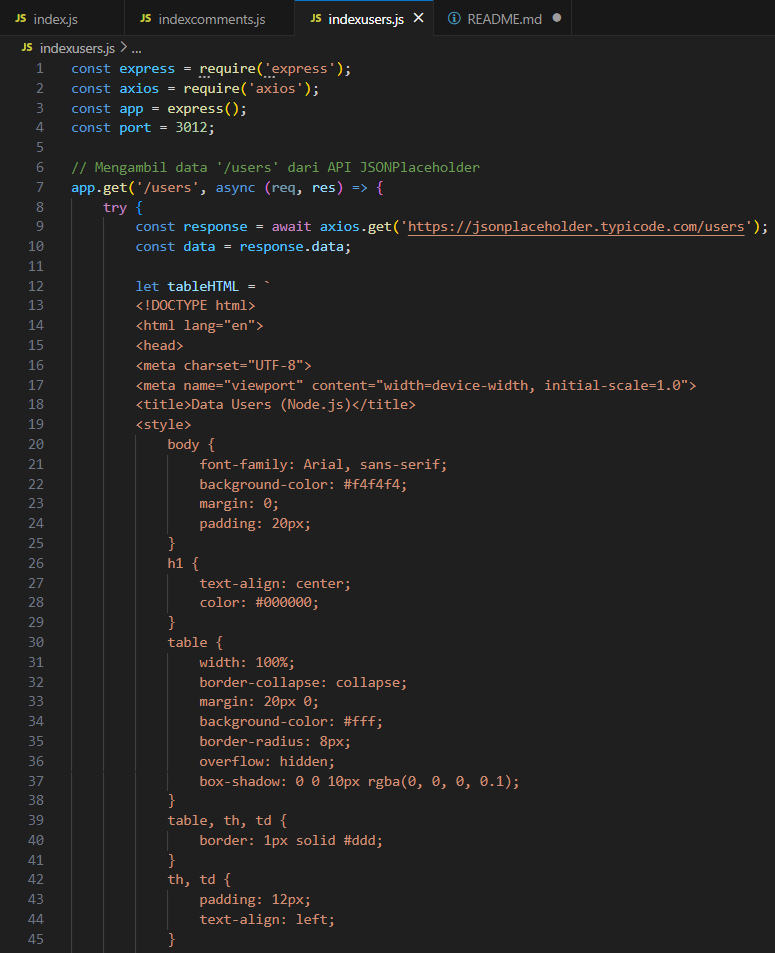
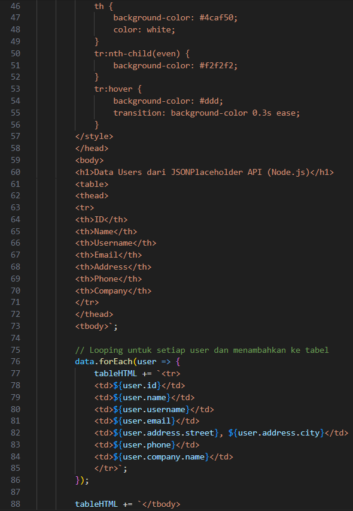
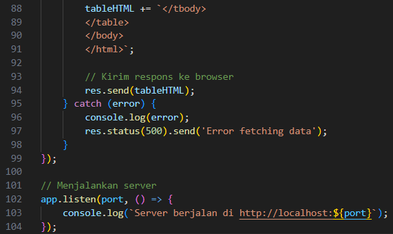
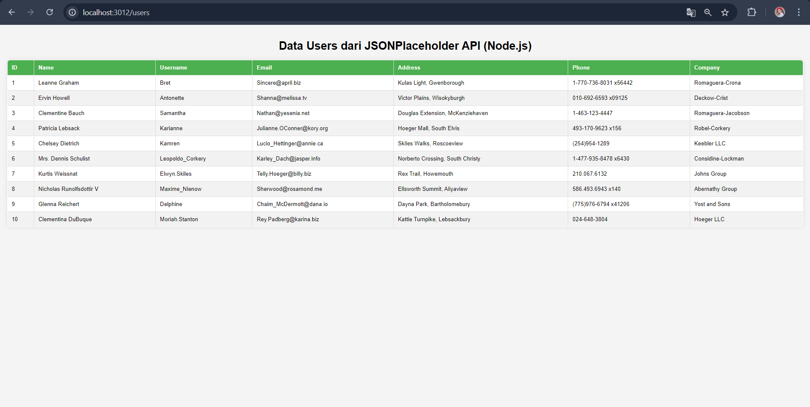
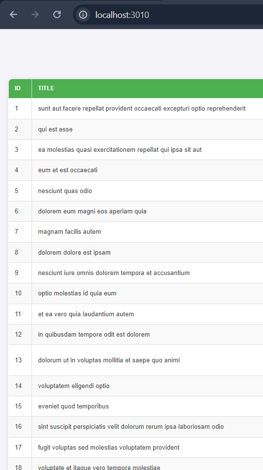
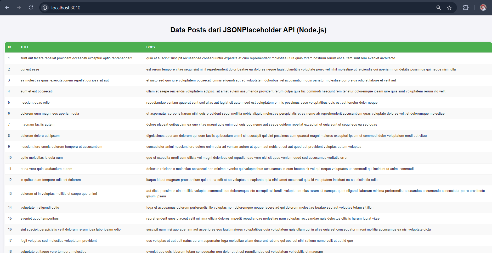

1. Implementasi Node.js untuk mengambil data dari resource '/comments' dan '/users'.

'/comments'

Hasil mengambil data dari resource '/comments'.

'/users'

Hasil mengambil data dari resource 'users'.

2. Menambahkan fitur filter data berdasarkan "ID" dan "Title".

Tampilan penuhnya akan menjadi seperti berikut ini.

